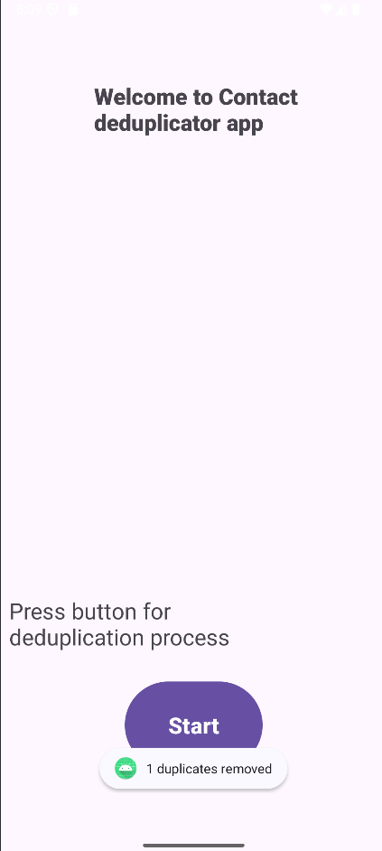

# ContactDeduplicator

    

## Description

mini-Android application ContactDeduplicator for removing duplicate contacts. Contacts are considered duplicates if they have the exact same name, email address, and phone number.

## Run

1) Run application at emulator or at your device
2) Provide the app with the necessary permissions
3) Press "Start" button
